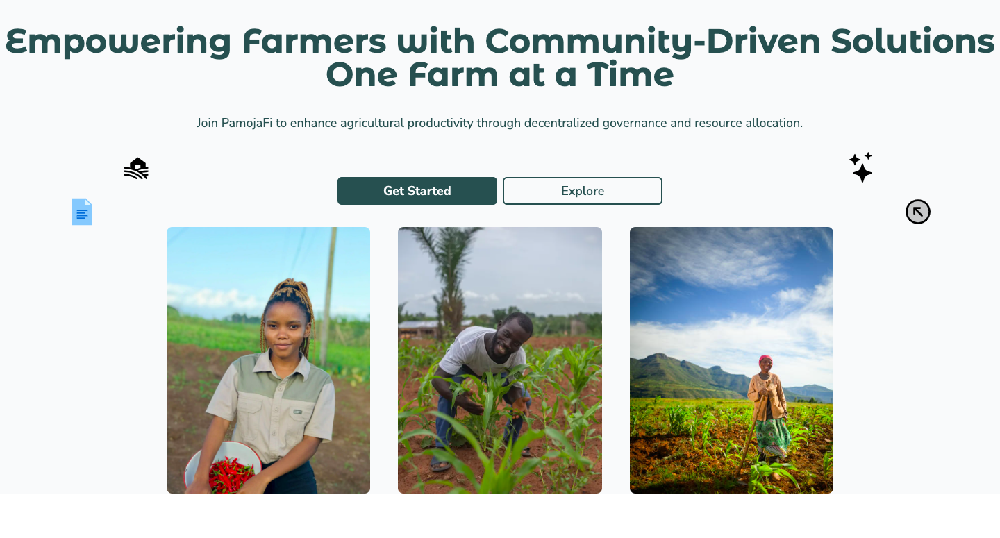

---

# 🌱 **PamojaFi**  
### Empowering Farmers with Community-Driven Decisions and Resource Allocation 🌾

---

**PamojaFi** is a decentralized platform designed to provide farmers with community-driven governance, resource allocation, and funding. Using DAO-like features, PamojaFi enables transparent and fair decision-making, ensuring equitable distribution of resources through the power of blockchain technology.

---

## 🌍 **Project Overview**

**PamojaFi** connects farmers with investors, donors, agribusinesses, and communities, allowing them to submit project proposals for financial and material support. Contributors review and vote on these proposals, supporting the projects they find most viable. The platform leverages **quadratic voting**, **Coinbase attestations** for user verification, and **smart contracts** to ensure transparency and trust throughout the process.

**Key objectives** of PamojaFi:
- **Improve financial access** for farmers using decentralized models.
- Promote **sustainable agriculture** and enhance community decision-making.
- Use **blockchain** to maintain transparency and trust across all operations.

---

## 🎯 **Key Features**

### 🗳 **Decentralized Governance**

- **Governance Token**: PamojaFi uses governance tokens to represent **voting power**. Contributors earn tokens by participating in funding, voting, and platform engagement.
- **Quadratic Voting**: A fair voting system that ensures balanced governance by preventing wealthier users from dominating decisions.
- **Proposal & Voting System**: Farmers submit project proposals, and the community votes on them using the platform’s transparent and decentralized voting mechanism.
- **Smart Contract Execution**: Approved proposals are executed automatically through smart contracts, ensuring secure and trustworthy implementation.

---

### 🚜 **Project Proposal and Approval Process**

- **Proposal Submission**: Farmers submit comprehensive proposals, outlining their goals, needs, and projected outcomes.
- **Community Voting**: The community reviews and votes on submitted projects using **quadratic voting**, ensuring a fair and transparent decision-making process.

---

### 💰 **Transparent Resource Allocation**

- **Funding Pools**: Contributors add funds to collective pools, which are then allocated to approved projects based on voting outcomes.
- **Staking**: Users can stake governance tokens in support of specific projects, providing further incentive to engage and contribute.

---

### 🔒 **User Verification with Coinbase Attestations**

- **Coinbase Attestations**: The platform uses Coinbase's secure verification method to ensure that only genuine, verified users participate in governance and funding.
- **Safe Participation**: Verified users gain access to voting, proposal submission, and resource allocation.

---

### 🌟 **Reputation and Incentive Systems**

- **Reputation Points**: Users accumulate reputation based on their contributions to the platform, giving them more influence in the decision-making process.
- **Incentives**: Active participants earn **governance tokens**, which can be used to influence the platform’s future direction.

---

### 🔑 **Smart Contract-Driven Fund Distribution**

- **ERC4626A Smart Contracts**: Funding for approved projects is managed through milestone-based smart contracts, ensuring funds are securely distributed when project phases are successfully completed.

---

### 🗣 **Community Engagement and Feedback**

- Contributors can provide feedback on project proposals, influencing other participants' decisions and guiding fund allocation.
- **DAO Feedback Loop**: Community feedback is integrated into the DAO decision-making process, continuously improving governance and project selection.

---

## 🔄 **How PamojaFi Works**

1. **User Verification**: All users are verified through **Coinbase Attestations** to ensure authenticity.
2. **Proposal Submission**: Farmers submit project proposals via the platform.
3. **Quadratic Voting**: The community votes on proposals using quadratic voting to ensure balanced decision-making.
4. **Resource Allocation**: The most supported projects are allocated funds from the collective pool, as determined by the DAO’s governance vote.
5. **Smart Contract-Based Fund Release**: Smart contracts automatically manage fund disbursement in phases, ensuring secure and transparent distribution.

## 🛠 **Technologies Used**

- **Base Blockchain**: For decentralized and scalable blockchain infrastructure.
- **Foundry**: For smart contract development and testing.
- **React & Thirdweb**: For building an intuitive frontend and user-friendly experience.
- **Coinbase Attestations**: For secure user verification, preventing fraudulent activities.
- **Quadratic Voting**: For ensuring balanced, fair decision-making in community governance.
- **Governance Tokens**: Used to incentivize participation and engagement.

---

## 🔗 **Smart Contract Links**

Explore the key smart contracts that power the PamojaFi platform:

- **PamojaFi Contract**: [View Contract](https://sepolia.basescan.org/address/0xda5be4b4e653eebeecbb8f2b6a5ed282f9dafcc0) - The main contract governing the PamojaFi ecosystem.
- **Governance Contract**: [Governance Token](https://sepolia.basescan.org/address/0xe26ff48b1a6f3c6ccab1b209424bf4c9cbfa44d6) - Manages the governance tokens used for voting and decision-making.
- **TimeLock Contract**: [TimeLock](https://sepolia.basescan.org/address/0x7e5b345773577aaf03fe7269ca1eaff85f9661b5) - Ensures that funds are locked for a specified period before being released.
- **Governor Contract**: [Governor](https://sepolia.basescan.org/address/0x52b69a18be99c9848e412b3529cb23938fa0de67) - Facilitates the governance process, allowing users to propose and vote on changes.

---

## 🌟 **Benefits of PamojaFi**

1. **Democratic Governance**: Every participant plays a role in the decision-making process through decentralized voting and staking.
2. **Transparency**: All decisions and transactions are recorded on the blockchain, ensuring full transparency for users.
3. **Security**: Verified users and milestone-based smart contracts ensure that funds are distributed securely.
4. **Incentivized Participation**: Contributors are rewarded with governance tokens, motivating continuous platform engagement.

---

Join us in revolutionizing the agricultural sector with decentralized technology and community-driven decisions!

---
