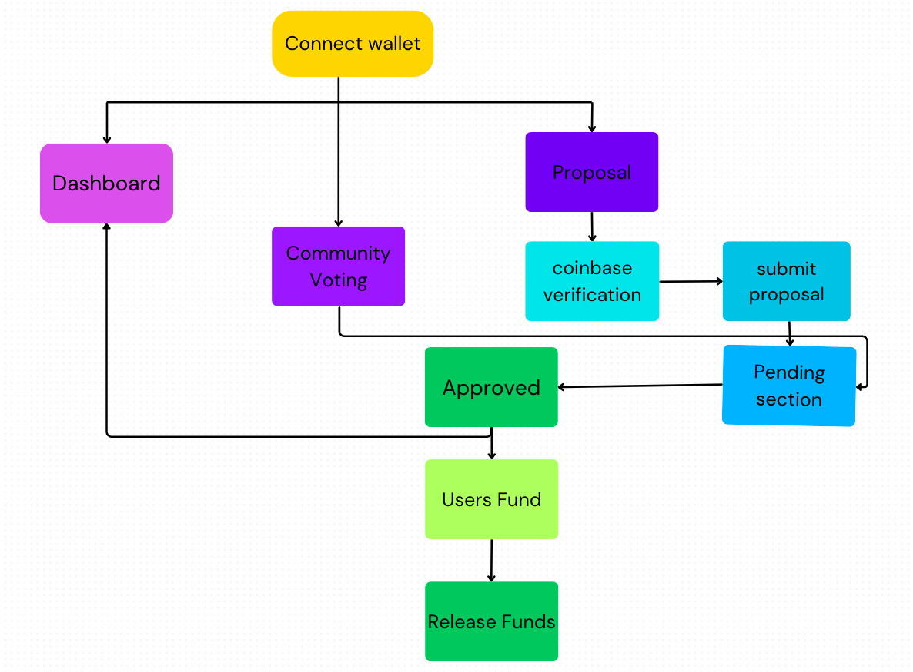

---

# 🎉 User Flow for PamojaFi Application 🌱

## Start

- **Connect Wallet**
  - User connects their **crypto wallet** as the first step 🔑.

---

## 🚀 User Actions

### 1. **Dashboard**
   - After connecting the wallet, users land on the **Dashboard** 📊.
   - **Options available:**
     - **Submit Proposal** 📝
     - **Community Voting** 🗳️
     - **Browse Proposals** 🔍

---

## 🌾 Farmer Actions

### 2. **Submit Proposal**
   - User selects **"Submit Proposal"** ➕.
   - Input **Project Title**, **Description**, and **Funding Goal** 🎯.
   - Complete **Coinbase verification** for identity check 🔍.
   - Once verified, submit the proposal to the **Pending Section** 📂.
   - Await **community voting** for approval.

---

## 👨‍💼 Admin & Governance Actions

### 3. **Community Voting**
   - Once the proposal is submitted, it undergoes **Community Voting**.
   - **Members cast votes** to either support or reject the proposal 🗳️.
   - If the majority support it, the proposal gets **approved** ✅.

---

## 💰 Funder Actions

### 4. **Users Fund**
   - Once a proposal is **approved**, users can contribute funds 💸.
   - **Funders** pledge amounts to the project 📊.
   - After funding goals are reached, the system allows the **release of funds** 💵.

---

### 5. **Release Funds**
   - After successful **community voting** and adequate funding, funds are **released** to the project owner 💰.
---

🔚 End Flow
After completing any action or review, users can log out or continue to explore other features. Secure logout options are available to ensure account safety.

